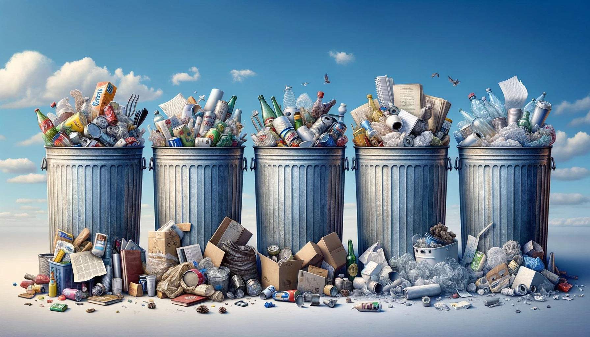

# 🌍 Imbalanced Garbage Classification with ResNet50 
## 🔄 Tackling Imbalanced Data from Scratch to Transfer Learning

## 📖 Overview
This repository is dedicated to the significant challenge of garbage classification using the ResNet50 architecture. Given the escalating environmental concerns, automating waste segregation through sophisticated models can potentially revolutionize waste management and recycling processes. The dataset employed, though rich, comes with its set of challenges, particularly the class imbalance. This project chronicles our journey through dataset analysis, combating imbalances, data augmentation, and constructing models both from scratch and leveraging transfer learning with ResNet50.

## ❓ Problem Statement
In our quest to aid environmental conservation, the aim is to craft a garbage classification system proficient in differentiating between various waste types. With ResNet50 at the core, the project navigates through class imbalances, introduces data augmentation techniques, and evaluates models designed from scratch and via transfer learning.

## 🎯 Objectives
The project's roadmap is as follows:
* **Dataset Exploration:** An in-depth analysis of the garbage dataset, highlighting class imbalances.
* **Tackle Imbalance:** Implement class weights in the loss function to counter dataset disparities.
* **Implement Data Augmentation:** Enhance model robustness and deter overfitting.
* **Construct ResNet50:** Engineer a tailor-made ResNet50 for garbage classification from ground zero.
* **Employ Transfer Learning:** Harness a pre-trained ResNet50, fine-tuning it for our distinct dataset.
* **Evaluate Models:** Rigorously test both models using diverse metrics to guarantee reliable classifications.

## 📚 Dataset Description
### 🌐 Overview
The **Garbage Image Dataset** offers a unique opportunity for those keen on diving into garbage classification via deep learning paradigms. Boasting a total of **2,527 images** spread across six distinct classes - Cardboard, Glass, Metal, Paper, Plastic, and Trash - it's an invaluable asset for creating and benchmarking waste classification algorithms.

### 🔍 Specifications 
- 🖼️ **Total Images**: 2,527
- 📏 **Image Dimensions**: 512x384 pixels
- 📂 **Format**: JPEG

### 📊 Class Distribution 
- 📦 **Cardboard**: 403
- 🥂 **Glass**: 501
- 🛢️ **Metal**: 410
- 🗞️ **Paper**: 594
- 🥤 **Plastic**: 482
- 🗑️ **Trash**: 137

## 📁 File Descriptions
- 📓 **`Imbalanced_Garbage_Classification_ResNet50_Scratch_to_TransferLearning.ipynb`**: Jupyter notebook containing data exploration, augmentation, modeling, and evaluation.
- 📘 **`README.md`**: This very file offering a comprehensive overview of the project.

## 🚀 Instructions for Local Execution
1. **Clone this Repository**: Begin by cloning this repository to your machine.
2. **Open the Notebook**: Navigate to `Imbalanced_Garbage_Classification_ResNet50_Scratch_to_TransferLearning.ipynb` in Jupyter.
3. **Install Dependencies**: Ensure all necessary Python libraries are installed for flawless execution.
4. **Execution**: Run all cells in the notebook to explore insights and outcomes. Note that training the models can be time-consuming, especially on local systems.

## 🔗 Additional Resources
- 🌐 **Kaggle Notebook**: For those inclined towards the Kaggle environment, explore the notebook [here](https://www.kaggle.com/code/farzadnekouei/imbalanced-garbage-classification-resnet50).
- 🌐 **Dataset Source**: Access the dataset [here](https://www.kaggle.com/datasets/farzadnekouei/trash-type-image-dataset).
- 🤝 **Connect on LinkedIn**: Have questions or open to collaborations? Let's connect on [LinkedIn](https://linkedin.com/in/farzad-nekouei-7535aa53/). 
